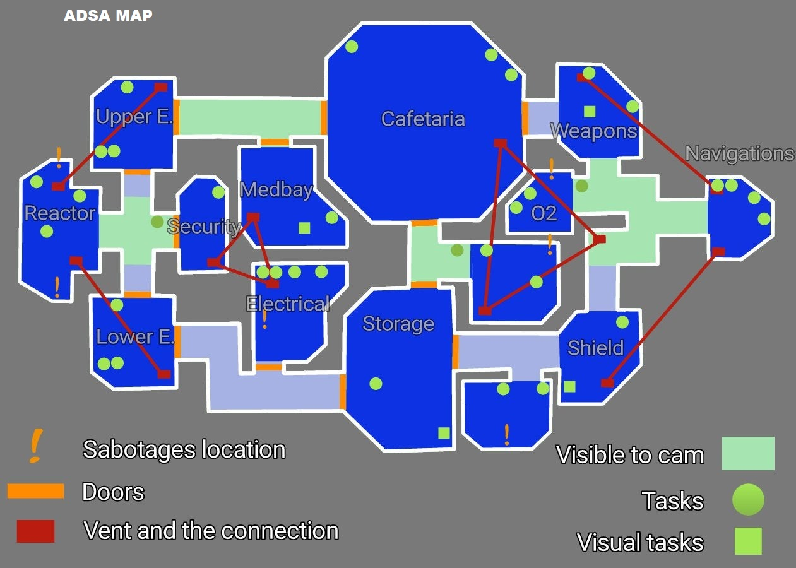

# AmongUs-Graph-Problems

**Date de réalisation :** Décembre 2020

**Cadre du projet :** Cours "Advanced Data Structure & Algorithms" en 4ème année à l’ESILV (2ème année du cycle ingénieur), réalisé en binôme avec Parth

**Langage utilisé :** Python

 

## Présentation du projet

Ce projet est constitué de quatre exercices permettant de mettre en application nos connaissances sur la théorie des graphes et les différents types de structures de données avec le langage Python.

Le sujet est disponible ici : https://complex-systems-ai.com/algorithm/adsa-project-among-us/

Les 4 exercices sont les suivants :
-	Organisation d’un tournoi Among Us
-	Recherche des imposteurs en sachant quels sont les joueurs qui se sont vus et étant donné que les deux imposteurs ne se sont jamais vus (**coloration de graphe**)
-	Recherche du plus court chemin entre deux salles pour les joueurs ou pour les imposteurs sachant que ces derniers peuvent utiliser des trappes (**algorithme Floyd-Warshall**)

La carte suivante représente les différentes pièces du vaisseau :

 

-	Recherche d’une route passant par toutes les salles exactement une fois (**graphe hamiltonien**)

## Description des différents fichiers

Les quatre exercices correspondent aux fichiers `Part_1.py`, `Part_2.py`, `Part_3.py` et `Part_4.py`. Vous pouvez tout simplement lancer le fichier `Menu.py` pour naviguer entre les différentes parties du projet. Le fichier `Graph.py` est utile aux 3 derniers exercices.

